# Visual Prototypes: What AncestralFire Could Render

> **These Mermaid diagrams use real data from Roger Parkinson's 72,182-ancestor database.** Each diagram represents what a UI component could look like — family trees, migration flows, timelines, geographic distribution, battle connections. Mermaid is the wireframe; a production app would render these as interactive, zoomable, shareable visualizations.

---

## 1. Roger's Paternal Lineage — Lancashire to Idaho

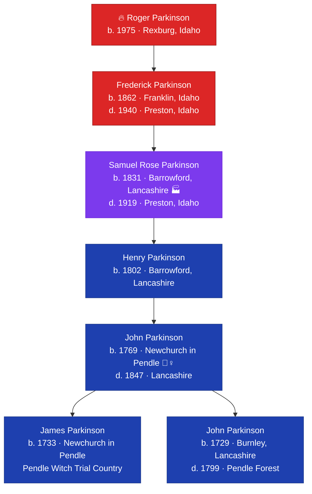

**What the UI would do:** Click any ancestor → expand their story card with Wikipedia context, YouTube documentaries, and Wikidata enrichment. Samuel's card would show Barrowford cotton mill history, the Lancashire Cotton Famine, and links to BBC documentaries about Pendle.

---

## 2. The Great Migration — Europe to Idaho

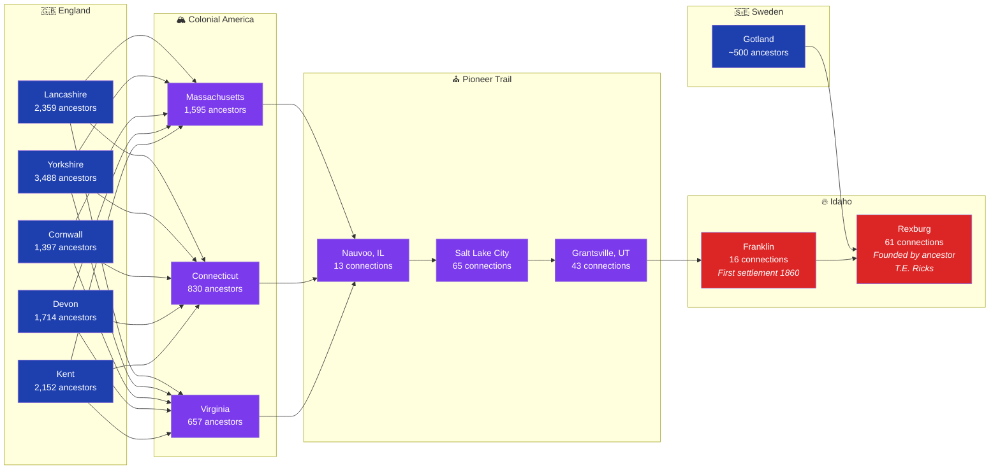

**What the UI would do:** Animated flow showing ancestors moving across the map over centuries. Click any node → see the actual people who lived there. The Lancashire→Idaho path lights up the Parkinson line. The Gotland→Idaho path lights up the Ostberg line.

---

## 3. The Ancestor Population Through Time

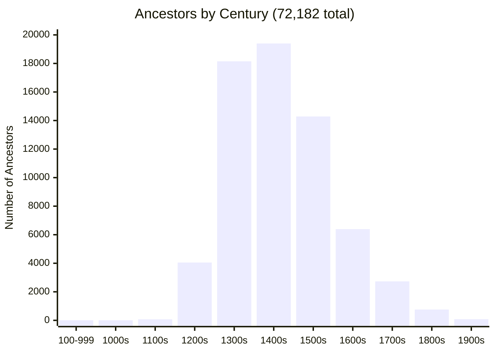

**What the UI would do:** Interactive timeline — hover over a bar to see the top surnames, locations, and historical events of that century. Click the 1400s bar → "19,397 ancestors lived through the Wars of the Roses, the fall of Constantinople, and the dawn of the Renaissance."

---

## 4. Where Your Ancestors Came From — Geographic Heatmap

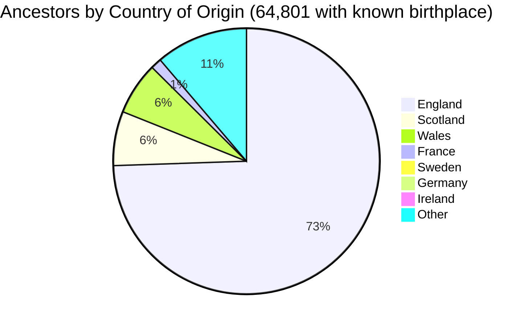

**What the UI would do:** This would be a real interactive map — a globe you can spin, with heat zones glowing over England, Scotland, Wales. Zoom into England and see county-level detail: Yorkshire (3,488), Suffolk (2,601), Cheshire (2,585), Lancashire (2,359), Kent (2,152). Click any county → see the surnames concentrated there + Wikipedia context about that region.

---

## 5. English County Deep Dive

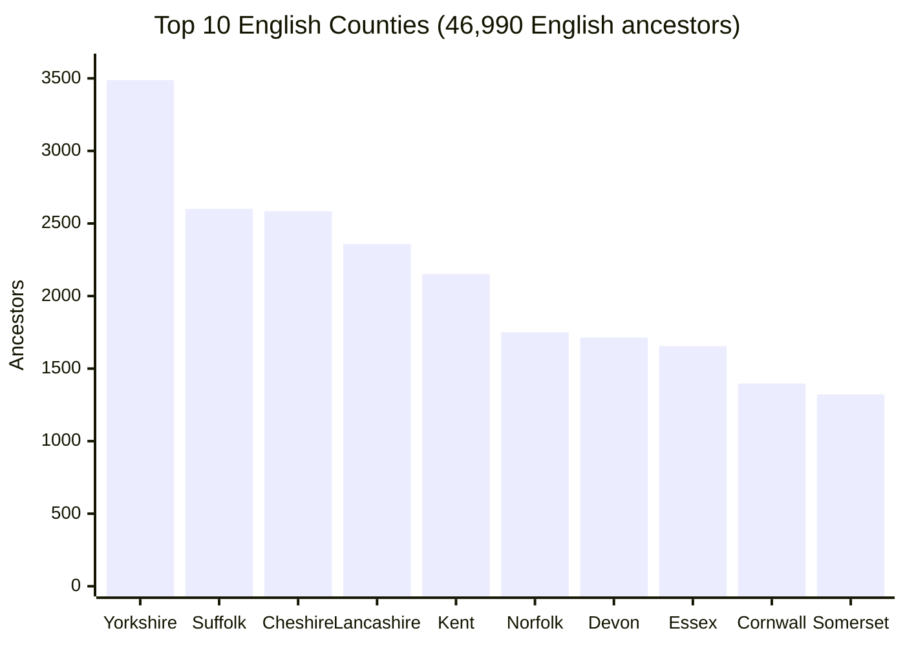

---

## 6. Your Ancestors and the Battles of History

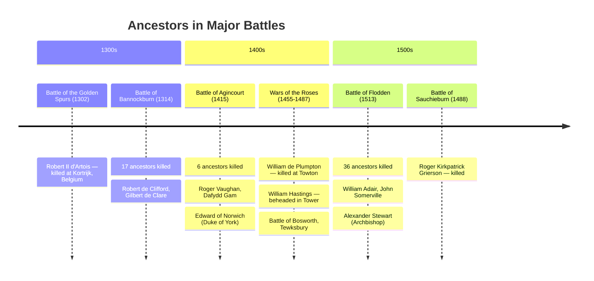

**What the UI would do:** Interactive timeline with battle maps. Click "Agincourt" → animated map of the battle, list of your 6 ancestors who were there, YouTube documentary embed, Wikipedia context about Henry V's campaign. "Your ancestor Dafydd Gam was reportedly the inspiration for Shakespeare's character Fluellen."

---

## 7. The Tower of London — Your Family's Dark Connection

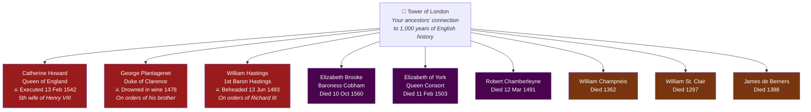

**What the UI would do:** 3D model of the Tower of London. Click locations within the Tower to see which of your ancestors were there. Tower Green → Catherine Howard's execution site. The Bowyer Tower → George Plantagenet drowned in a barrel of Malmsey wine. Beauchamp Tower → prisoners who scratched their names into the walls.

---

## 8. The Enrichment Pipeline — What Makes Stories Come Alive

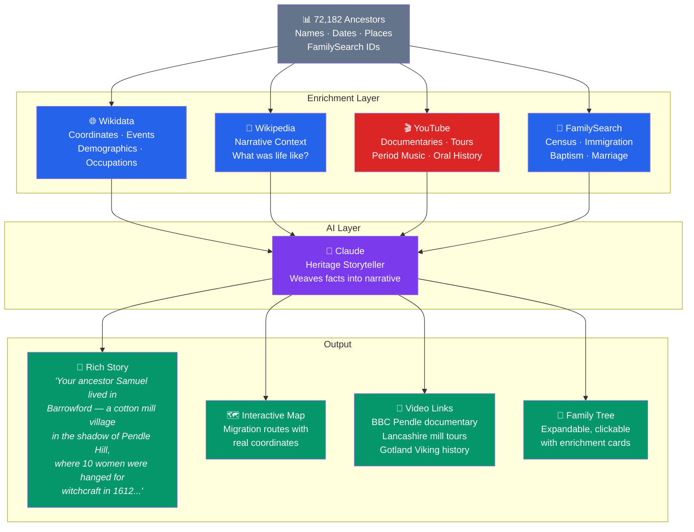

---

## 9. The Mormon Pioneer Trail — Your Family's Westward Path

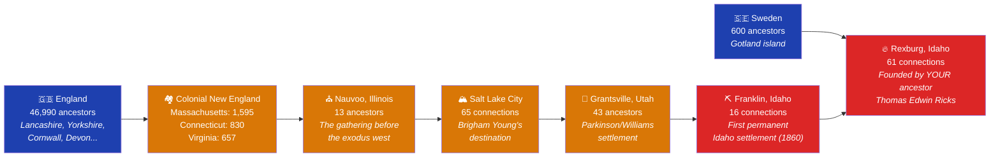

---

## 10. Famous Ancestors — Your Connection to History

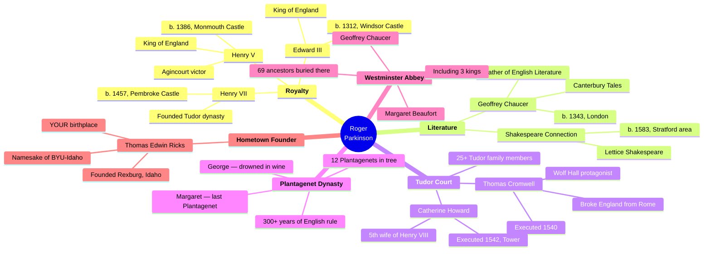

---

## 11. The Swedish Line — Gotland to Idaho

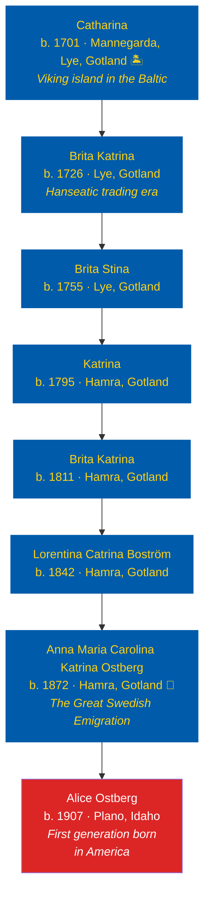

**What the UI would do:** Side panel shows Gotland Wikipedia article + Wikidata (coordinates, population, history). YouTube embed: "Gotland: Sweden's Viking Island" documentary. Map shows the Baltic Sea with Gotland highlighted, then an animated line across the Atlantic to Idaho.

---

## 12. The American Story — Where Your Ancestors Settled

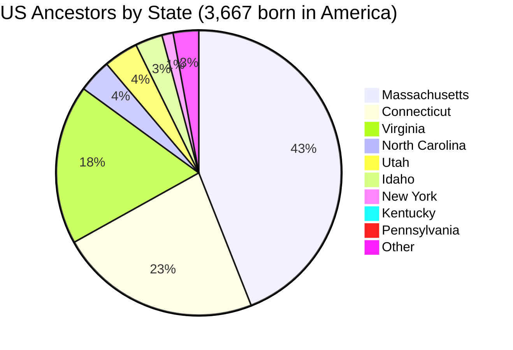

---

## 13. The Top 10 Surnames in Your Tree

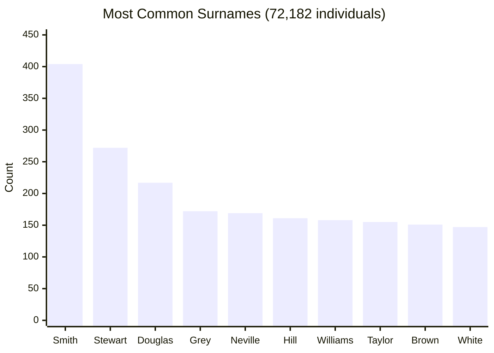

**What the UI would do:** Click a surname → see all individuals with that name, their geographic distribution, and their time span. "The 169 Nevilles in your tree span from Neville de Raby (1100s, County Durham) to Hannah Alice Neville (1910, Idaho). The Neville family was one of the most powerful in medieval England — your ancestor Cecily Neville was mother to two kings."

---

## What These Prototypes Prove

1. **The data is real** — 72,182 ancestors, all queryable, all enrichable
2. **The visualizations write themselves** — the data is so rich that every diagram tells a story
3. **Mermaid is the wireframe** — production would use D3.js, Mapbox, BALKAN FamilyTree JS, Three.js
4. **Every node is clickable** — every ancestor connects to Wikipedia, Wikidata, YouTube, FamilySearch
5. **The enrichment pipeline multiplies value** — raw names become interactive history lessons

### From Mermaid to Production UI

| Mermaid Prototype | Production Component |
|-------------------|---------------------|
| Family tree (graph TD) | BALKAN FamilyTree JS — zoomable, expandable, with photo cards |
| Migration flow (flowchart LR) | Mapbox GL — animated routes on a real world map |
| Timeline | D3.js timeline — scrollable, with event cards and Wikipedia popups |
| Pie/bar charts | Chart.js or Recharts — interactive, filterable, drillable |
| Mind map | Force-directed graph (D3) — draggable, with relationship lines |
| Tower of London | Three.js — 3D model with clickable locations |
| Battle connections | Mapbox with battle site markers + YouTube documentary links |

---

*Every diagram above uses real data from Roger's database. This is not mockup data. These are actual ancestors, actual locations, actual dates. The product makes 72,182 names come alive.*
