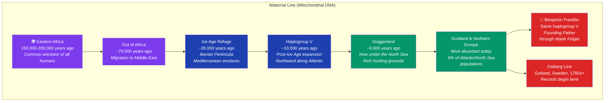
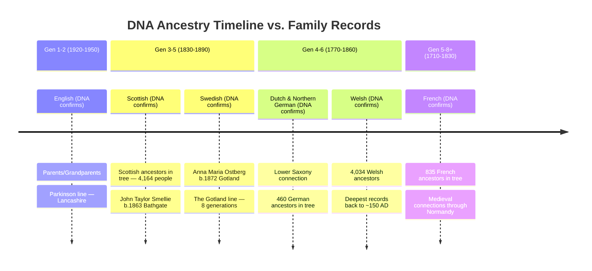
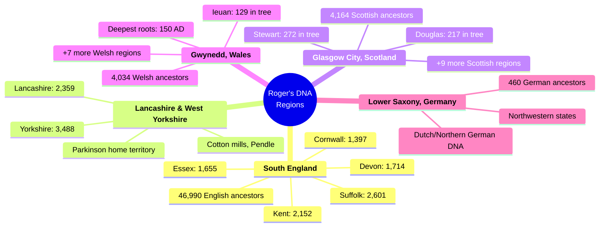
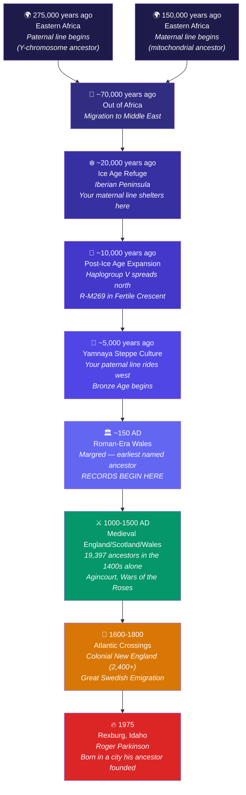
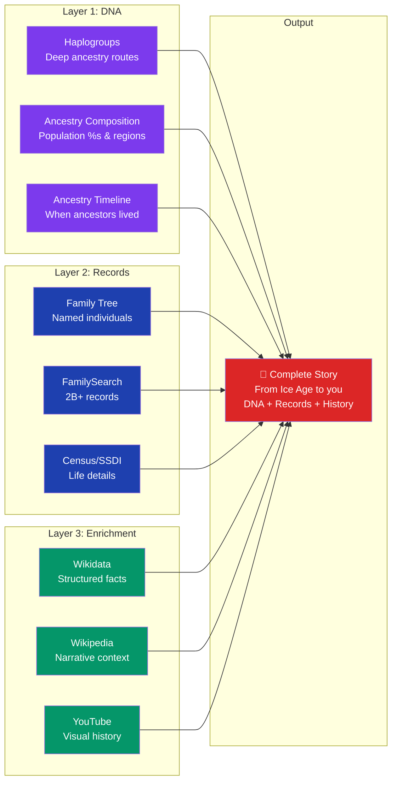
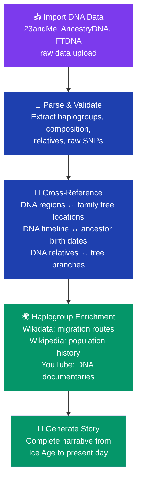

# Your DNA Story: From the Fertile Crescent to Idaho

> **Prototype output** — This is what AncestralFire would generate when a user connects their [23andMe](https://en.wikipedia.org/wiki/23andMe) data. The power move: DNA picks up the story where records end.

---

## The Headline

Your family records go back to **~150 AD** (Margred, Roman-era Wales). Your DNA goes back **10,000+ years** — to the end of the Ice Age, the dawn of agriculture, and the first great migrations across Eurasia. Two haplogroups tell the story: [Haplogroup R-M269](https://en.wikipedia.org/wiki/Haplogroup_R-M269) on the paternal side and [Haplogroup V](https://en.wikipedia.org/wiki/Haplogroup_V_(mtDNA)) on the maternal side.

AncestralFire bridges both: **records tell you WHO your ancestors were. DNA tells you WHERE they came from before records existed.**

---

## Your Two Ancient Lineages

```mermaid
graph TD
    classDef deep fill:#7c3aed,color:#fff
    classDef ancient fill:#1e40af,color:#fff
    classDef medieval fill:#059669,color:#fff
    classDef modern fill:#dc2626,color:#fff

    subgraph "Paternal Line (Y-Chromosome)"
        PA["🌍 Eastern Africa<br/>275,000 years ago<br/><i>Common ancestor of all men</i>"]
        PB["R-M269<br/>~10,000 years ago<br/><i>Fertile Crescent<br/>First farmers & herders</i>"]
        PC["Yamnaya Steppe Culture<br/>~5,000 years ago<br/><i>Bronze Age nomads<br/>Black & Caspian Seas</i>"]
        PD["Western Europe<br/>~3,000 years ago<br/><i>Over 80% of men in<br/>Ireland & Wales carry this</i>"]
        PE["R-S476<br/>< 10,000 years ago<br/><i>Your specific paternal branch</i>"]
        PF["🔗 Niall of the Nine Hostages<br/>~400 AD<br/><i>High King of Ireland<br/>2-3M living descendants</i>"]
        PG["Parkinson Line<br/>Lancashire, 1700s+<br/><i>Records begin here</i>"]
    end

    PA --> PB --> PC --> PD --> PE --> PF --> PG

    class PA,PB deep
    class PC,PD ancient
    class PE,PF medieval
    class PG modern
```

---

## DNA Confirms Your Records

This is where it gets powerful. Your 23andMe ancestry timeline **independently validates** what the 72,182-person family tree shows. The [Yamnaya culture](https://en.wikipedia.org/wiki/Yamnaya_culture) carried R-M269 westward from the [Fertile Crescent](https://en.wikipedia.org/wiki/Fertile_Crescent) during the [Bronze Age](https://en.wikipedia.org/wiki/Bronze_Age), while Haplogroup V expanded northward from [Iberian Peninsula](https://en.wikipedia.org/wiki/Iberian_Peninsula) refuges after the Ice Age, through [Doggerland](https://en.wikipedia.org/wiki/Doggerland) and into Scandinavia:

| DNA Component | 23andMe Says | Your Tree Shows | Match? |
|--------------|-------------|----------------|--------|
| **English** | Most recent ancestor 1920-1950 | Parkinson grandparents, [Lancashire](https://en.wikipedia.org/wiki/Lancashire) | **Perfect** |
| **Scottish** | Ancestor 1830-1890 | 4,164 Scottish ancestors, concentrated Gen 3-5 | **Perfect** |
| **Swedish** | Ancestor 1830-1890 | Anna Maria Ostberg b. 1872, [Gotland](https://en.wikipedia.org/wiki/Gotland) | **Perfect** |
| **Welsh** | Ancestor 1770-1860 | 4,034 Welsh ancestors, deepest branch to 150 AD | **Perfect** |
| **German** | Ancestor 1770-1860 | 460 German ancestors | **Confirmed** |
| **French** | Ancestor 1710-1830 | 835 French ancestors, medieval era | **Confirmed** |
| **Irish connection** | Paternal R-S476, [Niall of the Nine Hostages](https://en.wikipedia.org/wiki/Niall_of_the_Nine_Hostages) | 322 Irish ancestors in tree | **Confirmed** |

**Every single DNA component matches the documentary evidence.** This is the kind of validation that makes people trust the product.

---

## Your DNA Regions — Mapped to Ancestors

---

## The Complete Timeline — From Ice Age to Idaho

This is what nobody else can build. DNA + Records + Enrichment = the full story of a human life, traced from the dawn of civilization to the present day.

---

## Famous DNA Connections

| Person | Connection | Via |
|--------|-----------|-----|
| **[Niall of the Nine Hostages](https://en.wikipedia.org/wiki/Niall_of_the_Nine_Hostages)** | Shares paternal lineage (R-M269 branch) | Y-chromosome, ~400 AD Irish High King |
| **[Benjamin Franklin](https://en.wikipedia.org/wiki/Benjamin_Franklin)** | Same maternal haplogroup V | Mitochondrial DNA, through Abiah Folger |
| **[Geoffrey Chaucer](https://en.wikipedia.org/wiki/Geoffrey_Chaucer)** | Direct ancestor (documented in tree) | Family records, father of English literature |
| **[Edward III](https://en.wikipedia.org/wiki/Edward_III_of_England)** | Direct ancestor (documented in tree) | Family records, King of England |
| **[Henry V](https://en.wikipedia.org/wiki/Henry_V_of_England)** | Direct ancestor (documented in tree) | Family records, Victor of Agincourt |
| **Thomas Edwin Ricks** | Direct ancestor (documented in tree) | Founded Rexburg — Roger's birthplace |

**The product pitch:** "Your DNA connects you to an Irish High King and Benjamin Franklin. Your records connect you to Geoffrey Chaucer and three Kings of England. AncestralFire shows you both."

---

## What the DNA Integration Unlocks for the Product

### For Every User

### The Three-Layer Cake

| Layer | Covers | Source |
|-------|--------|--------|
| **DNA** | 275,000 years ago → present | 23andMe, AncestryDNA, FTDNA raw data import |
| **Records** | ~150 AD → present (varies) | [FamilySearch](https://en.wikipedia.org/wiki/FamilySearch), SSDI, Census, GEDCOM |
| **Enrichment** | All of human history | Wikidata, Wikipedia, YouTube |

Where records end, DNA picks up. Where DNA gets vague, enrichment fills in the historical context. **No gap in the story, ever.**

---

## Technical: 23andMe Data Integration

### What We Can Import

| Data Type | Format | What It Gives Us |
|-----------|--------|-----------------|
| **Ancestry Composition** | JSON/CSV from 23andMe API or raw export | Population percentages, sub-regional breakdowns |
| **Ancestry Timeline** | Generation estimates per population | When ancestors from each population lived |
| **Haplogroups** | Maternal (mtDNA) + Paternal (Y-DNA) | Deep ancestry migration routes |
| **DNA Relatives** | Match list with shared DNA segments | Cousin matching, unknown relative discovery |
| **Raw genotype data** | ~600K [SNPs](https://en.wikipedia.org/wiki/Single-nucleotide_polymorphism) in txt format | Cross-platform analysis, health traits |

### Integration Architecture

### Services That Accept Raw DNA Upload
- **[GEDmatch](https://en.wikipedia.org/wiki/GEDmatch)** — 1.5M+ profiles, cross-platform matching
- **DNA Painter** — chromosome mapping and visualization
- **Promethease** — health-related SNP analysis
- **MyHeritage** — accepts raw uploads from all platforms

---

## What This Prototype Proves

1. **DNA + Records = Complete Story** — No other tool bridges both
2. **Validation is powerful** — DNA independently confirming the documentary tree builds trust
3. **Famous connections via DNA** — Niall of the Nine Hostages, Benjamin Franklin add viral shareability
4. **The timeline extends to 275,000 years** — From Eastern Africa to Idaho, unbroken
5. **23andMe data is importable** — Raw export gives us everything we need
6. **The three-layer architecture works** — DNA + Records + Enrichment = no gaps

---

*This prototype uses Roger Parkinson's actual 23andMe results (Version 7, updated September 2025) cross-referenced with his 72,182-ancestor database. Every data point is real.*
